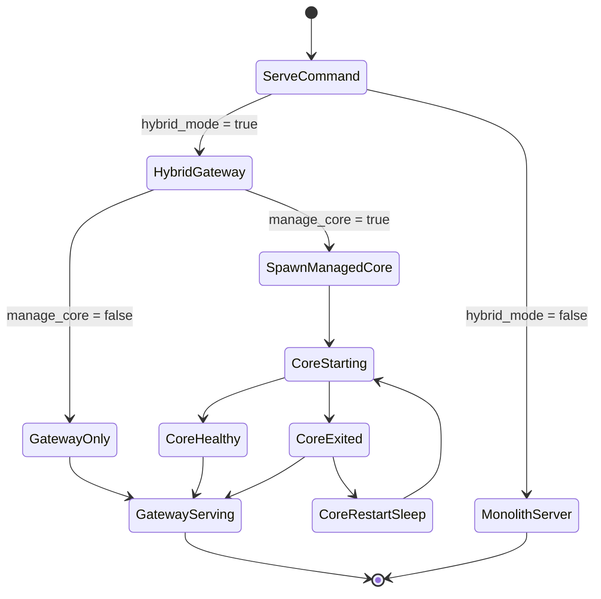
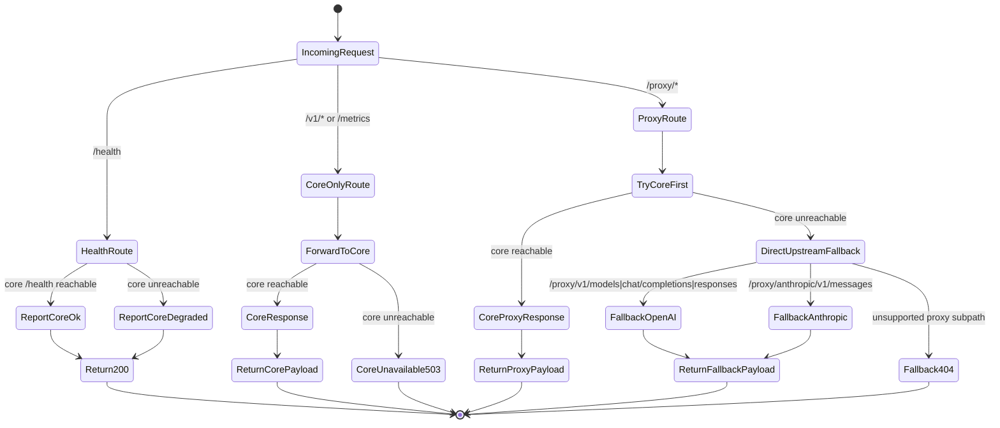
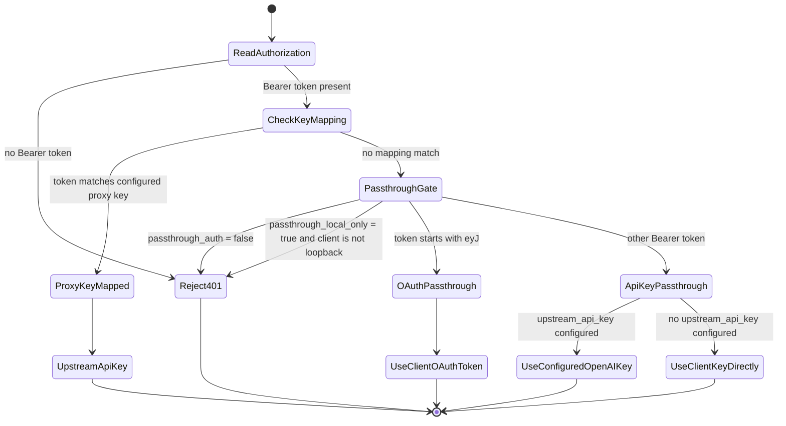
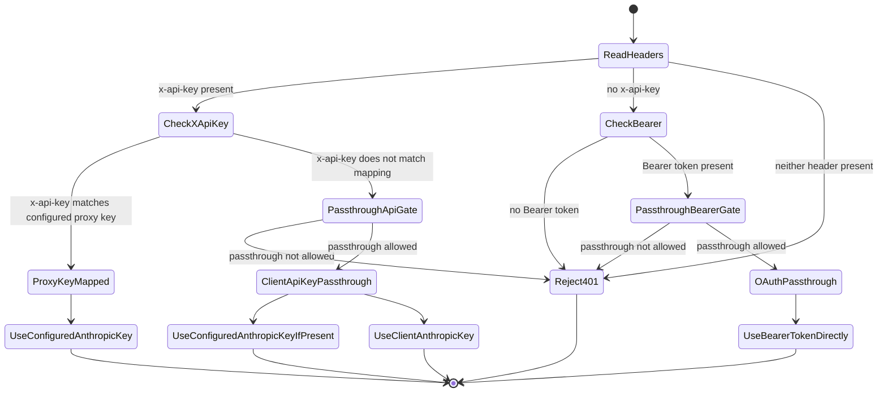
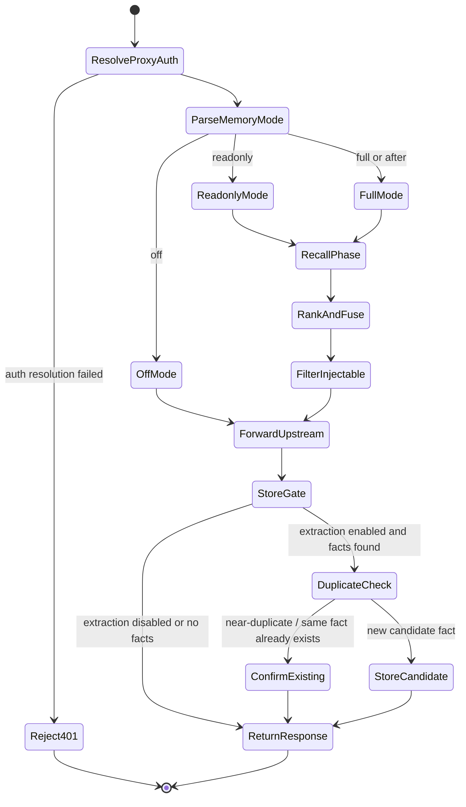
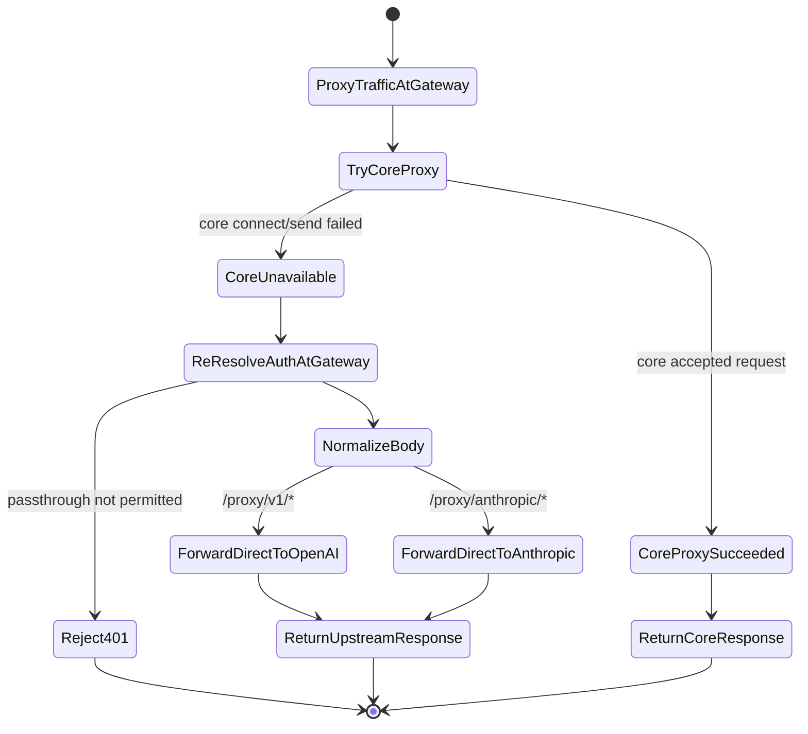
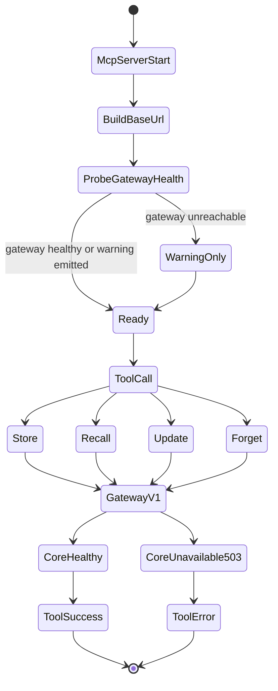
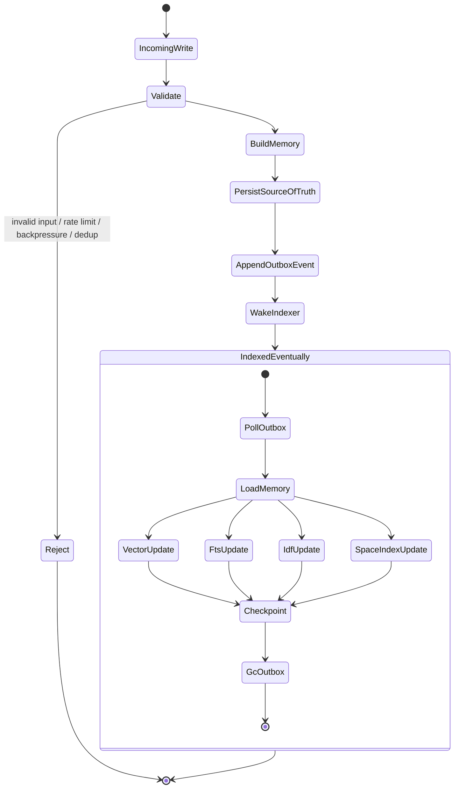
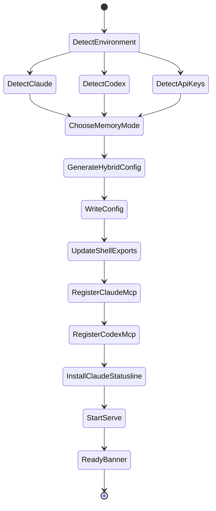

# State Machines

These diagrams describe the system as it is currently implemented after the hybrid gateway/core split.

Relevant code anchors:
- [src/main.rs](/root/engraim/src/main.rs)
- [src/config.rs](/root/engraim/src/config.rs)
- [src/server/gateway.rs](/root/engraim/src/server/gateway.rs)
- [src/server/mod.rs](/root/engraim/src/server/mod.rs)
- [src/server/routes.rs](/root/engraim/src/server/routes.rs)
- [src/server/proxy.rs](/root/engraim/src/server/proxy.rs)
- [src/mcp.rs](/root/engraim/src/mcp.rs)
- [src/memory.rs](/root/engraim/src/memory.rs)
- [src/engines/document.rs](/root/engraim/src/engines/document.rs)
- [tests/integration.rs](/root/engraim/tests/integration.rs)

## 1. Runtime Topology

The important architectural fact is:
- `memoryoss serve` starts the **hybrid gateway** when `server.hybrid_mode = true`
- the gateway can manage a loopback **memory core** child
- automatic failover is **gateway -> direct upstream passthrough**
- MCP is a parallel explicit-tool path, not the transport failover path

## 2. Hybrid Gateway Request Routing

The gateway distinguishes three classes of traffic:
- `/health` is always answered by the gateway
- `/v1/*` and `/metrics` are **core-only** and return `503` if the core is unavailable
- `/proxy/*` first tries the core and then fails open to direct upstream passthrough

## 3. OpenAI / Codex Proxy Auth Resolution

This is the effective decision tree used both by the core proxy path and by direct gateway fallback.

## 4. Anthropic / Claude Proxy Auth Resolution

Anthropic has two live auth paths:
- `x-api-key` for API keys
- `Authorization: Bearer ...` for OAuth passthrough

## 5. Core Proxy Path

When the core is healthy, this is the main memory path for both Claude and Codex proxy traffic.

## 6. Fail-Open Fallback Path

This is the most important system-level change in the current architecture.

Important consequence:
- if the **core** dies, Claude/Codex can keep talking to the upstream LLM through the gateway
- if the **gateway** dies, there is no failover because clients are pointed at the gateway itself

## 7. MCP HTTP Client Path

The MCP server is an HTTP client over stdio. It talks to the HTTP server configured in `Config::bind_addr()`.

In hybrid mode that means:
- MCP talks to the **gateway**
- the gateway then forwards `/v1/*` to the core
- if the core is down, MCP gets a clear `503 memoryOSS core unavailable`

## 8. Memory Lifecycle

`archived` is still a boolean overlay, not a dedicated enum state.

## 9. Write and Index Pipeline

## 10. Setup Wizard

The wizard now writes a hybrid config:
- `hybrid_mode = true`
- `core_port = port + 1` (or env override)
- MCP registration for Claude/Codex
- local `BASE_URL` exports for supported clients

Current shell export logic:
- Claude detected or `ANTHROPIC_API_KEY` present -> write `ANTHROPIC_BASE_URL`
- Codex detected or `OPENAI_API_KEY` present -> write `OPENAI_BASE_URL`
- MCP is still registered in parallel

## 11. System-Level Verification Summary

These are the most important paths now verified in tests:

- Hybrid gateway fail-open covers all 4 auth combinations:
  - Codex OAuth
  - Codex API key
  - Claude OAuth
  - Claude API key
- Gateway proxies memory API calls to a healthy core
- `memoryoss serve` manages the core child and reports gateway health correctly
- Wizard still completes successfully across the scenario matrix

## 12. Residual Limits

These are architectural limits, not unverified guesses:

- MCP is **not** the transport failover for the same model request
- automatic failover exists only for **proxy traffic through the gateway**
- if the gateway process itself is down, clients pointed at the gateway still fail
- `/v1/*` memory API and MCP continue to depend on a healthy core

## 13. Coverage Implications for `tests/run_all.sh`

The current runner should cover:
- Rust formatting, linting, unit tests, integration tests
- CRUD write path
- recall path
- query explain path
- lifecycle feedback transitions
- lifecycle admin view
- MCP store/recall/update/forget
- proxy transport paths: OpenAI `models`, `chat/completions`, `responses`, Anthropic `messages`
- hybrid gateway fail-open for all 4 auth paths
- gateway-managed core startup
- sharing create/list/grant/remove/accessible
- sharing webhook delivery
- GDPR export/access/certified forget
- key rotation/list/revoke and restart/grace-expiry coverage
- decay, backup/restore, and embedding migration command coverage
- setup wizard smoke path
- setup wizard matrix
- TypeScript SDK build/test
- dependency audit when an offline advisory DB is available
