# State Machines

These diagrams describe the system as it is currently implemented after the hybrid gateway/core split.

Relevant code anchors:
- [src/main.rs](/root/engraim/src/main.rs)
- [src/config.rs](/root/engraim/src/config.rs)
- [src/server/gateway.rs](/root/engraim/src/server/gateway.rs)
- [src/server/mod.rs](/root/engraim/src/server/mod.rs)
- [src/server/routes.rs](/root/engraim/src/server/routes.rs)
- [src/server/proxy.rs](/root/engraim/src/server/proxy.rs)
- [src/mcp.rs](/root/engraim/src/mcp.rs)
- [src/memory.rs](/root/engraim/src/memory.rs)
- [src/engines/document.rs](/root/engraim/src/engines/document.rs)
- [tests/integration.rs](/root/engraim/tests/integration.rs)

## 1. Runtime Topology

The important architectural fact is:
- `memoryoss serve` starts the **hybrid gateway** when `server.hybrid_mode = true`
- the gateway can manage a loopback **memory core** child
- automatic failover is **gateway -> direct upstream passthrough**
- MCP is a parallel explicit-tool path, not the transport failover path

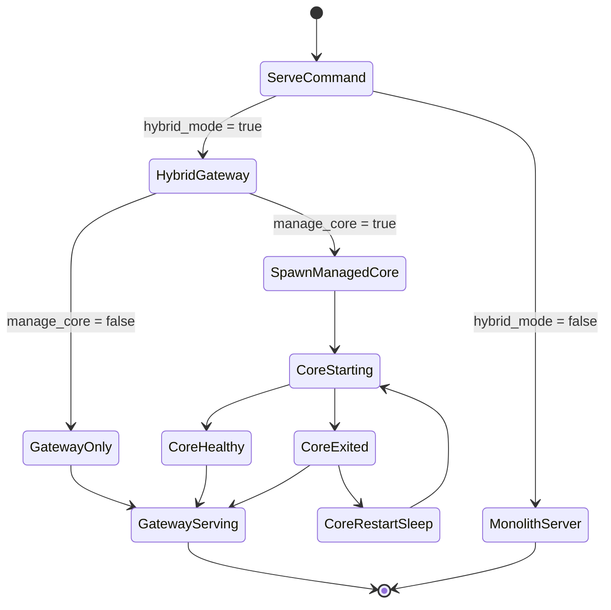
```mermaid
stateDiagram-v2
    [*] --> ServeCommand

    ServeCommand --> MonolithServer: hybrid_mode = false
    ServeCommand --> HybridGateway: hybrid_mode = true

    HybridGateway --> SpawnManagedCore: manage_core = true
    HybridGateway --> GatewayOnly: manage_core = false

    SpawnManagedCore --> CoreStarting
    CoreStarting --> CoreHealthy
    CoreStarting --> CoreExited
    CoreExited --> CoreRestartSleep
    CoreRestartSleep --> CoreStarting

    GatewayOnly --> GatewayServing
    CoreHealthy --> GatewayServing
    CoreExited --> GatewayServing

    GatewayServing --> [*]
    MonolithServer --> [*]
```

## 2. Hybrid Gateway Request Routing

The gateway distinguishes three classes of traffic:
- `/health` is always answered by the gateway
- `/v1/*` and `/metrics` are **core-only** and return `503` if the core is unavailable
- `/proxy/*` first tries the core and then fails open to direct upstream passthrough

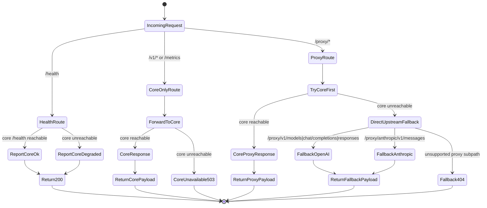
```mermaid
stateDiagram-v2
    [*] --> IncomingRequest

    IncomingRequest --> HealthRoute: /health
    IncomingRequest --> CoreOnlyRoute: /v1/* or /metrics
    IncomingRequest --> ProxyRoute: /proxy/*

    HealthRoute --> ReportCoreOk: core /health reachable
    HealthRoute --> ReportCoreDegraded: core unreachable
    ReportCoreOk --> Return200
    ReportCoreDegraded --> Return200

    CoreOnlyRoute --> ForwardToCore
    ForwardToCore --> CoreResponse: core reachable
    ForwardToCore --> CoreUnavailable503: core unreachable
    CoreResponse --> ReturnCorePayload

    ProxyRoute --> TryCoreFirst
    TryCoreFirst --> CoreProxyResponse: core reachable
    TryCoreFirst --> DirectUpstreamFallback: core unreachable
    CoreProxyResponse --> ReturnProxyPayload

    DirectUpstreamFallback --> FallbackOpenAI: /proxy/v1/models|chat/completions|responses
    DirectUpstreamFallback --> FallbackAnthropic: /proxy/anthropic/v1/messages
    DirectUpstreamFallback --> Fallback404: unsupported proxy subpath

    FallbackOpenAI --> ReturnFallbackPayload
    FallbackAnthropic --> ReturnFallbackPayload

    Return200 --> [*]
    ReturnCorePayload --> [*]
    ReturnProxyPayload --> [*]
    ReturnFallbackPayload --> [*]
    CoreUnavailable503 --> [*]
    Fallback404 --> [*]
```

## 3. OpenAI / Codex Proxy Auth Resolution

This is the effective decision tree used both by the core proxy path and by direct gateway fallback.

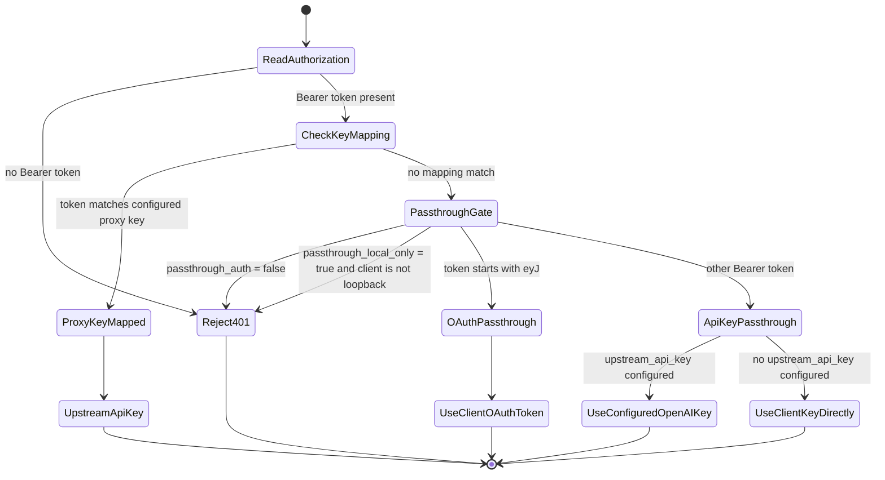
```mermaid
stateDiagram-v2
    [*] --> ReadAuthorization
    ReadAuthorization --> Reject401: no Bearer token

    ReadAuthorization --> CheckKeyMapping: Bearer token present
    CheckKeyMapping --> ProxyKeyMapped: token matches configured proxy key
    CheckKeyMapping --> PassthroughGate: no mapping match

    PassthroughGate --> Reject401: passthrough_auth = false
    PassthroughGate --> Reject401: passthrough_local_only = true and client is not loopback
    PassthroughGate --> OAuthPassthrough: token starts with eyJ
    PassthroughGate --> ApiKeyPassthrough: other Bearer token

    ProxyKeyMapped --> UpstreamApiKey
    ApiKeyPassthrough --> UseConfiguredOpenAIKey: upstream_api_key configured
    ApiKeyPassthrough --> UseClientKeyDirectly: no upstream_api_key configured
    OAuthPassthrough --> UseClientOAuthToken

    UpstreamApiKey --> [*]
    UseConfiguredOpenAIKey --> [*]
    UseClientKeyDirectly --> [*]
    UseClientOAuthToken --> [*]
    Reject401 --> [*]
```

## 4. Anthropic / Claude Proxy Auth Resolution

Anthropic has two live auth paths:
- `x-api-key` for API keys
- `Authorization: Bearer ...` for OAuth passthrough

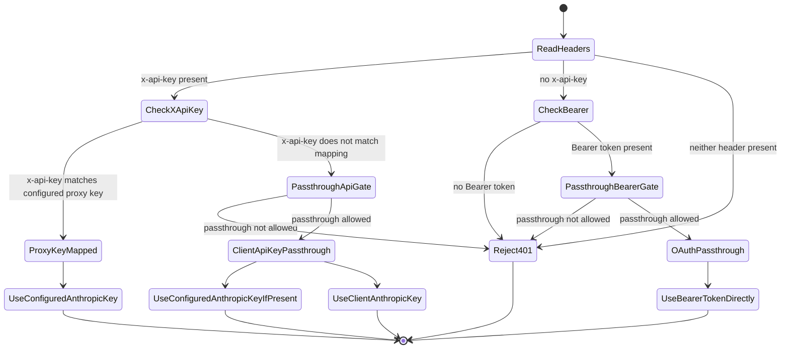
```mermaid
stateDiagram-v2
    [*] --> ReadHeaders

    ReadHeaders --> CheckXApiKey: x-api-key present
    ReadHeaders --> CheckBearer: no x-api-key
    ReadHeaders --> Reject401: neither header present

    CheckXApiKey --> ProxyKeyMapped: x-api-key matches configured proxy key
    CheckXApiKey --> PassthroughApiGate: x-api-key does not match mapping

    PassthroughApiGate --> Reject401: passthrough not allowed
    PassthroughApiGate --> ClientApiKeyPassthrough: passthrough allowed

    CheckBearer --> Reject401: no Bearer token
    CheckBearer --> PassthroughBearerGate: Bearer token present
    PassthroughBearerGate --> Reject401: passthrough not allowed
    PassthroughBearerGate --> OAuthPassthrough: passthrough allowed

    ProxyKeyMapped --> UseConfiguredAnthropicKey
    ClientApiKeyPassthrough --> UseConfiguredAnthropicKeyIfPresent
    ClientApiKeyPassthrough --> UseClientAnthropicKey
    OAuthPassthrough --> UseBearerTokenDirectly

    UseConfiguredAnthropicKey --> [*]
    UseConfiguredAnthropicKeyIfPresent --> [*]
    UseClientAnthropicKey --> [*]
    UseBearerTokenDirectly --> [*]
    Reject401 --> [*]
```

## 5. Core Proxy Path

When the core is healthy, this is the main memory path for both Claude and Codex proxy traffic.

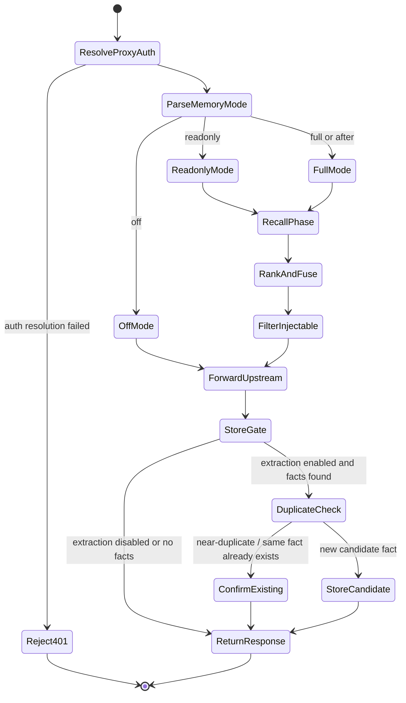
```mermaid
stateDiagram-v2
    [*] --> ResolveProxyAuth
    ResolveProxyAuth --> Reject401: auth resolution failed
    ResolveProxyAuth --> ParseMemoryMode

    ParseMemoryMode --> OffMode: off
    ParseMemoryMode --> ReadonlyMode: readonly
    ParseMemoryMode --> FullMode: full or after

    OffMode --> ForwardUpstream
    ReadonlyMode --> RecallPhase
    FullMode --> RecallPhase

    RecallPhase --> RankAndFuse
    RankAndFuse --> FilterInjectable
    FilterInjectable --> ForwardUpstream

    ForwardUpstream --> StoreGate
    StoreGate --> ReturnResponse: extraction disabled or no facts
    StoreGate --> DuplicateCheck: extraction enabled and facts found

    DuplicateCheck --> ConfirmExisting: near-duplicate / same fact already exists
    DuplicateCheck --> StoreCandidate: new candidate fact
    ConfirmExisting --> ReturnResponse
    StoreCandidate --> ReturnResponse

    Reject401 --> [*]
    ReturnResponse --> [*]
```

## 6. Fail-Open Fallback Path

This is the most important system-level change in the current architecture.

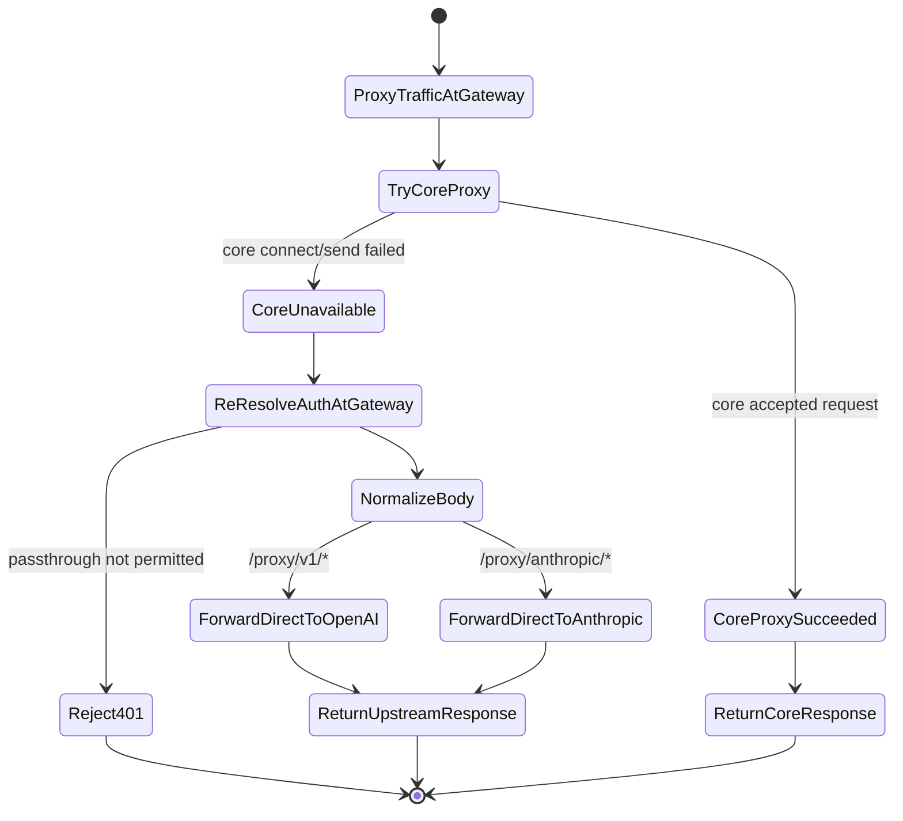
```mermaid
stateDiagram-v2
    [*] --> ProxyTrafficAtGateway
    ProxyTrafficAtGateway --> TryCoreProxy

    TryCoreProxy --> CoreProxySucceeded: core accepted request
    TryCoreProxy --> CoreUnavailable: core connect/send failed

    CoreUnavailable --> ReResolveAuthAtGateway
    ReResolveAuthAtGateway --> Reject401: passthrough not permitted
    ReResolveAuthAtGateway --> NormalizeBody

    NormalizeBody --> ForwardDirectToOpenAI: /proxy/v1/*
    NormalizeBody --> ForwardDirectToAnthropic: /proxy/anthropic/*

    ForwardDirectToOpenAI --> ReturnUpstreamResponse
    ForwardDirectToAnthropic --> ReturnUpstreamResponse

    CoreProxySucceeded --> ReturnCoreResponse
    Reject401 --> [*]
    ReturnUpstreamResponse --> [*]
    ReturnCoreResponse --> [*]
```

Important consequence:
- if the **core** dies, Claude/Codex can keep talking to the upstream LLM through the gateway
- if the **gateway** dies, there is no failover because clients are pointed at the gateway itself

## 7. MCP HTTP Client Path

The MCP server is an HTTP client over stdio. It talks to the HTTP server configured in `Config::bind_addr()`.

In hybrid mode that means:
- MCP talks to the **gateway**
- the gateway then forwards `/v1/*` to the core
- if the core is down, MCP gets a clear `503 memoryOSS core unavailable`

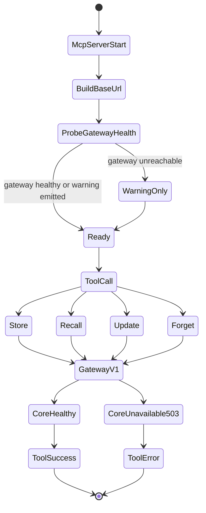
```mermaid
stateDiagram-v2
    [*] --> McpServerStart
    McpServerStart --> BuildBaseUrl
    BuildBaseUrl --> ProbeGatewayHealth
    ProbeGatewayHealth --> WarningOnly: gateway unreachable
    ProbeGatewayHealth --> Ready: gateway healthy or warning emitted

    Ready --> ToolCall
    ToolCall --> Store
    ToolCall --> Recall
    ToolCall --> Update
    ToolCall --> Forget

    Store --> GatewayV1
    Recall --> GatewayV1
    Update --> GatewayV1
    Forget --> GatewayV1

    GatewayV1 --> CoreHealthy
    GatewayV1 --> CoreUnavailable503

    CoreHealthy --> ToolSuccess
    CoreUnavailable503 --> ToolError

    ToolSuccess --> [*]
    ToolError --> [*]
    WarningOnly --> Ready
```

## 8. Memory Lifecycle

`archived` is still a boolean overlay, not a dedicated enum state.

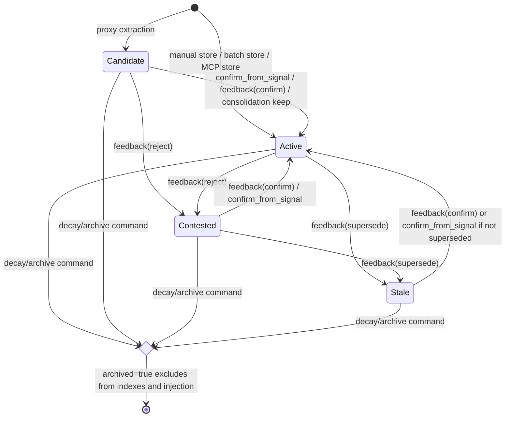
```mermaid
stateDiagram-v2
    [*] --> Active: manual store / batch store / MCP store
    [*] --> Candidate: proxy extraction

    Candidate --> Active: confirm_from_signal / feedback(confirm) / consolidation keep
    Candidate --> Contested: feedback(reject)

    Active --> Contested: feedback(reject)
    Active --> Stale: feedback(supersede)

    Contested --> Active: feedback(confirm) / confirm_from_signal
    Contested --> Stale: feedback(supersede)

    Stale --> Active: feedback(confirm) or confirm_from_signal if not superseded

    state ArchivedOverlay <<choice>>
    Active --> ArchivedOverlay: decay/archive command
    Candidate --> ArchivedOverlay: decay/archive command
    Contested --> ArchivedOverlay: decay/archive command
    Stale --> ArchivedOverlay: decay/archive command
    ArchivedOverlay --> [*]: archived=true excludes from indexes and injection
```

## 9. Write and Index Pipeline

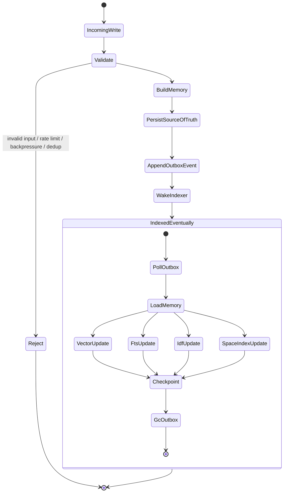
```mermaid
stateDiagram-v2
    [*] --> IncomingWrite
    IncomingWrite --> Validate
    Validate --> Reject: invalid input / rate limit / backpressure / dedup
    Validate --> BuildMemory
    BuildMemory --> PersistSourceOfTruth
    PersistSourceOfTruth --> AppendOutboxEvent
    AppendOutboxEvent --> WakeIndexer
    WakeIndexer --> IndexedEventually

    state IndexedEventually {
        [*] --> PollOutbox
        PollOutbox --> LoadMemory
        LoadMemory --> VectorUpdate
        LoadMemory --> FtsUpdate
        LoadMemory --> IdfUpdate
        LoadMemory --> SpaceIndexUpdate
        VectorUpdate --> Checkpoint
        FtsUpdate --> Checkpoint
        IdfUpdate --> Checkpoint
        SpaceIndexUpdate --> Checkpoint
        Checkpoint --> GcOutbox
        GcOutbox --> [*]
    }

    IndexedEventually --> [*]
    Reject --> [*]
```

## 10. Setup Wizard

The wizard now writes a hybrid config:
- `hybrid_mode = true`
- `core_port = port + 1` (or env override)
- MCP registration for Claude/Codex
- local `BASE_URL` exports for supported clients

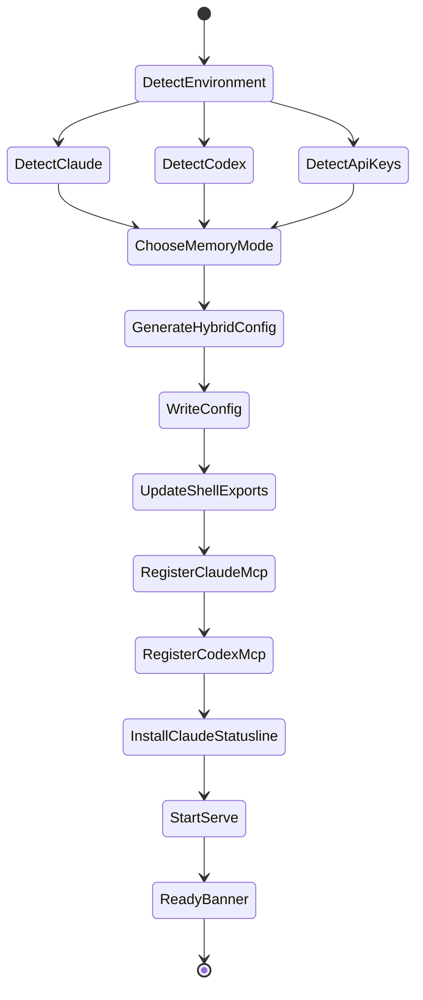
```mermaid
stateDiagram-v2
    [*] --> DetectEnvironment
    DetectEnvironment --> DetectClaude
    DetectEnvironment --> DetectCodex
    DetectEnvironment --> DetectApiKeys

    DetectClaude --> ChooseMemoryMode
    DetectCodex --> ChooseMemoryMode
    DetectApiKeys --> ChooseMemoryMode

    ChooseMemoryMode --> GenerateHybridConfig
    GenerateHybridConfig --> WriteConfig
    WriteConfig --> UpdateShellExports
    UpdateShellExports --> RegisterClaudeMcp
    RegisterClaudeMcp --> RegisterCodexMcp
    RegisterCodexMcp --> InstallClaudeStatusline
    InstallClaudeStatusline --> StartServe
    StartServe --> ReadyBanner
    ReadyBanner --> [*]
```

Current shell export logic:
- Claude detected or `ANTHROPIC_API_KEY` present -> write `ANTHROPIC_BASE_URL`
- Codex detected or `OPENAI_API_KEY` present -> write `OPENAI_BASE_URL`
- MCP is still registered in parallel

## 11. System-Level Verification Summary

These are the most important paths now verified in tests:

- Hybrid gateway fail-open covers all 4 auth combinations:
  - Codex OAuth
  - Codex API key
  - Claude OAuth
  - Claude API key
- Gateway proxies memory API calls to a healthy core
- `memoryoss serve` manages the core child and reports gateway health correctly
- Wizard still completes successfully across the scenario matrix

## 12. Residual Limits

These are architectural limits, not unverified guesses:

- MCP is **not** the transport failover for the same model request
- automatic failover exists only for **proxy traffic through the gateway**
- if the gateway process itself is down, clients pointed at the gateway still fail
- `/v1/*` memory API and MCP continue to depend on a healthy core

## 13. Coverage Implications for `tests/run_all.sh`

The current runner should cover:
- Rust formatting, linting, unit tests, integration tests
- CRUD write path
- recall path
- query explain path
- lifecycle feedback transitions
- lifecycle admin view
- MCP store/recall/update/forget
- proxy transport paths: OpenAI `models`, `chat/completions`, `responses`, Anthropic `messages`
- hybrid gateway fail-open for all 4 auth paths
- gateway-managed core startup
- sharing create/list/grant/remove/accessible
- sharing webhook delivery
- GDPR export/access/certified forget
- key rotation/list/revoke and restart/grace-expiry coverage
- decay, backup/restore, and embedding migration command coverage
- setup wizard smoke path
- setup wizard matrix
- TypeScript SDK build/test
- dependency audit when an offline advisory DB is available

## 14. Recall and Query-Explain Path

This is the ranking path used by admin `query-explain` and mirrored in the proxy recall stack.

Important behaviors:
- filter preselection uses FTS metadata when available, otherwise document scans
- vector/FTS channels are gated by index freshness unless `consistency=eventual`
- task-context re-ranking is fail-closed: ambiguous queries get **no** task-context boost

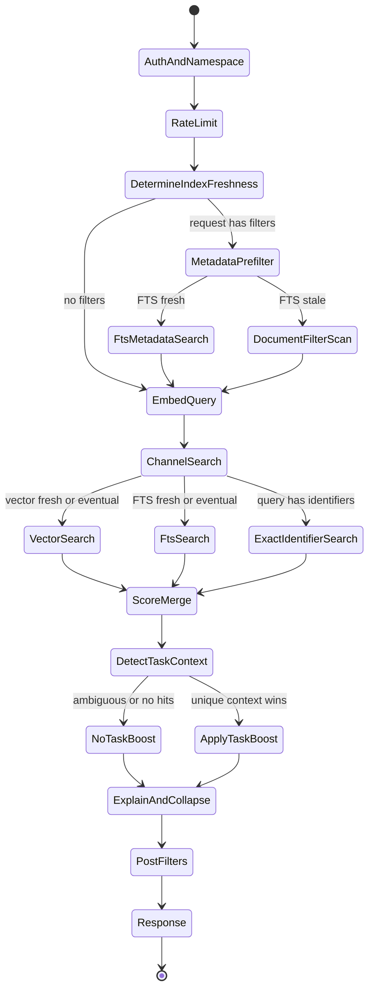
```mermaid
stateDiagram-v2
    [*] --> AuthAndNamespace
    AuthAndNamespace --> RateLimit
    RateLimit --> DetermineIndexFreshness

    DetermineIndexFreshness --> MetadataPrefilter: request has filters
    DetermineIndexFreshness --> EmbedQuery: no filters

    MetadataPrefilter --> FtsMetadataSearch: FTS fresh
    MetadataPrefilter --> DocumentFilterScan: FTS stale
    FtsMetadataSearch --> EmbedQuery
    DocumentFilterScan --> EmbedQuery

    EmbedQuery --> ChannelSearch
    ChannelSearch --> VectorSearch: vector fresh or eventual
    ChannelSearch --> FtsSearch: FTS fresh or eventual
    ChannelSearch --> ExactIdentifierSearch: query has identifiers

    VectorSearch --> ScoreMerge
    FtsSearch --> ScoreMerge
    ExactIdentifierSearch --> ScoreMerge

    ScoreMerge --> DetectTaskContext
    DetectTaskContext --> NoTaskBoost: ambiguous or no hits
    DetectTaskContext --> ApplyTaskBoost: unique context wins

    NoTaskBoost --> ExplainAndCollapse
    ApplyTaskBoost --> ExplainAndCollapse

    ExplainAndCollapse --> PostFilters
    PostFilters --> Response
    Response --> [*]
```

## 15. Proxy Injection, Extraction, and Outcome Learning

This path combines retrieval, injection, asynchronous extraction, contradiction detection, and lifecycle signals.

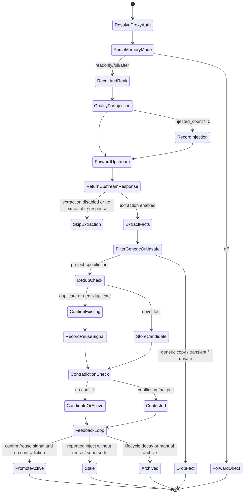
```mermaid
stateDiagram-v2
    [*] --> ResolveProxyAuth
    ResolveProxyAuth --> ParseMemoryMode

    ParseMemoryMode --> ForwardDirect: off
    ParseMemoryMode --> RecallAndRank: readonly/full/after

    RecallAndRank --> QualifyForInjection
    QualifyForInjection --> ForwardUpstream
    QualifyForInjection --> RecordInjection: injected_count > 0
    RecordInjection --> ForwardUpstream

    ForwardUpstream --> ReturnUpstreamResponse

    ReturnUpstreamResponse --> SkipExtraction: extraction disabled or no extractable response
    ReturnUpstreamResponse --> ExtractFacts: extraction enabled

    ExtractFacts --> FilterGenericOrUnsafe
    FilterGenericOrUnsafe --> DropFact: generic copy / transient / unsafe
    FilterGenericOrUnsafe --> DedupCheck: project-specific fact

    DedupCheck --> ConfirmExisting: duplicate or near-duplicate
    DedupCheck --> StoreCandidate: novel fact

    ConfirmExisting --> RecordReuseSignal
    RecordReuseSignal --> ContradictionCheck
    StoreCandidate --> ContradictionCheck

    ContradictionCheck --> CandidateOrActive: no conflict
    ContradictionCheck --> Contested: conflicting fact pair

    CandidateOrActive --> FeedbackLoop
    Contested --> FeedbackLoop

    FeedbackLoop --> PromoteActive: confirm/reuse signal and no contradiction
    FeedbackLoop --> Stale: repeated inject without reuse / supersede
    FeedbackLoop --> Archived: lifecycle decay or manual archive
    PromoteActive --> [*]
    Stale --> [*]
    Archived --> [*]
    DropFact --> [*]
    ForwardDirect --> [*]
```

## 16. Reload, Decay, and Consolidation Paths

The important system-level behavior after the audit fix is:
- startup and SIGHUP reload both **replace** namespace IP allowlists atomically
- automatic workers enumerate namespaces from the document engine
- CLI `memoryoss decay` now scans the union of configured namespaces, stored namespaces, and `default`

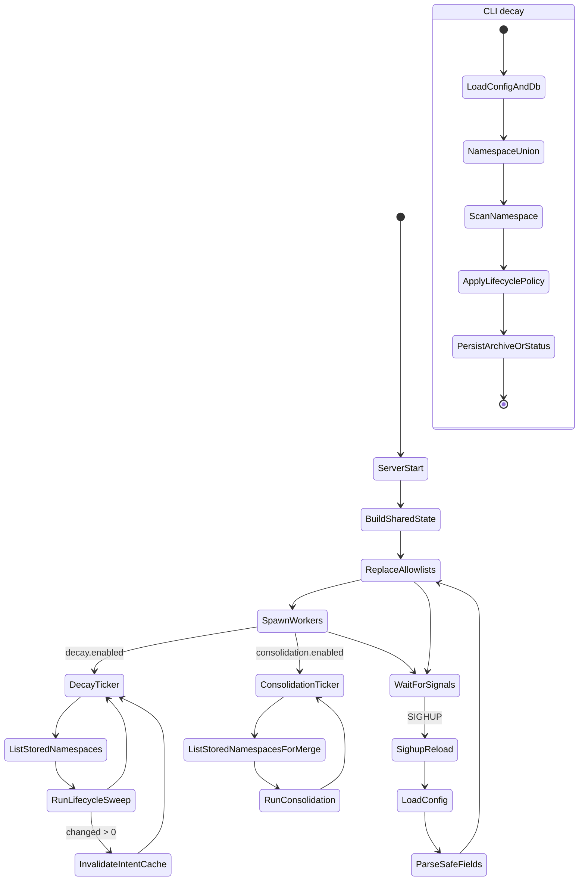
```mermaid
stateDiagram-v2
    [*] --> ServerStart
    ServerStart --> BuildSharedState
    BuildSharedState --> ReplaceAllowlists
    ReplaceAllowlists --> SpawnWorkers

    SpawnWorkers --> DecayTicker: decay.enabled
    SpawnWorkers --> ConsolidationTicker: consolidation.enabled
    SpawnWorkers --> WaitForSignals

    WaitForSignals --> SighupReload: SIGHUP
    SighupReload --> LoadConfig
    LoadConfig --> ParseSafeFields
    ParseSafeFields --> ReplaceAllowlists
    ReplaceAllowlists --> WaitForSignals

    DecayTicker --> ListStoredNamespaces
    ListStoredNamespaces --> RunLifecycleSweep
    RunLifecycleSweep --> InvalidateIntentCache: changed > 0
    RunLifecycleSweep --> DecayTicker
    InvalidateIntentCache --> DecayTicker

    ConsolidationTicker --> ListStoredNamespacesForMerge
    ListStoredNamespacesForMerge --> RunConsolidation
    RunConsolidation --> ConsolidationTicker

    state "CLI decay" as CliDecay {
        [*] --> LoadConfigAndDb
        LoadConfigAndDb --> NamespaceUnion
        NamespaceUnion --> ScanNamespace
        ScanNamespace --> ApplyLifecyclePolicy
        ApplyLifecyclePolicy --> PersistArchiveOrStatus
        PersistArchiveOrStatus --> [*]
    }
```

## 17. Release and Release-Smoke Validation Paths

The repository now has two intentionally separate distribution paths that share one reusable artifact-build workflow:
- `release.yml` for real `v*` tags
- `release-smoke.yml` for tagless validation on `smoke/*` or manual dispatch
- `build-release-artifacts.yml` as the shared build/package/upload path
- both paths now attach artifact attestations
- smoke additionally proves install -> checksum verify -> update/rollback recovery on Linux/macOS/Windows

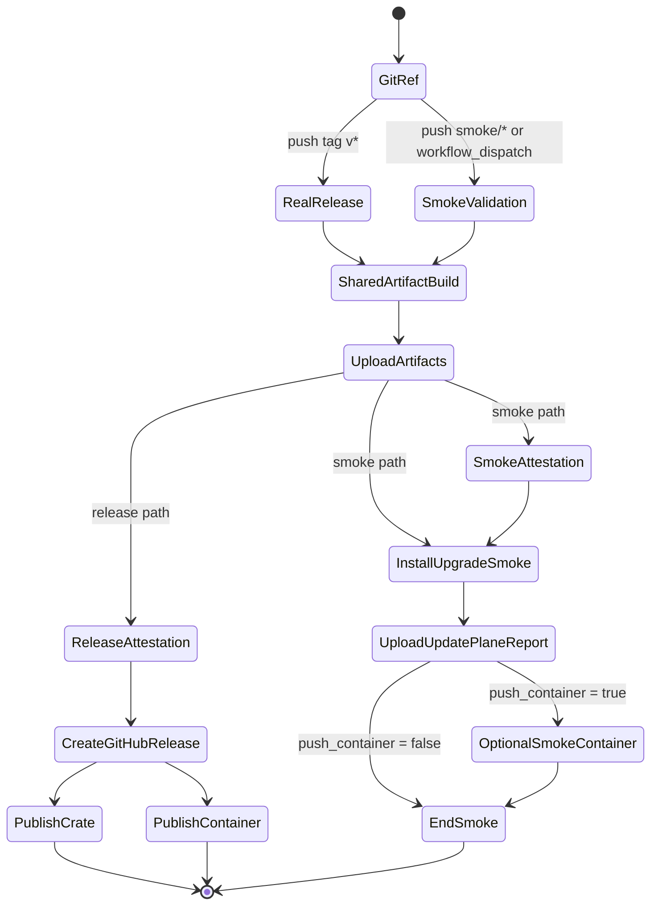
```mermaid
stateDiagram-v2
    [*] --> GitRef

    GitRef --> RealRelease: push tag v*
    GitRef --> SmokeValidation: push smoke/* or workflow_dispatch

    RealRelease --> SharedArtifactBuild
    SmokeValidation --> SharedArtifactBuild

    SharedArtifactBuild --> UploadArtifacts
    UploadArtifacts --> ReleaseAttestation: release path
    UploadArtifacts --> SmokeAttestation: smoke path
    UploadArtifacts --> InstallUpgradeSmoke: smoke path

    ReleaseAttestation --> CreateGitHubRelease
    CreateGitHubRelease --> PublishCrate
    CreateGitHubRelease --> PublishContainer

    SmokeAttestation --> InstallUpgradeSmoke
    InstallUpgradeSmoke --> UploadUpdatePlaneReport
    UploadUpdatePlaneReport --> OptionalSmokeContainer: push_container = true
    UploadUpdatePlaneReport --> EndSmoke: push_container = false
    OptionalSmokeContainer --> EndSmoke

    PublishCrate --> [*]
    PublishContainer --> [*]
    EndSmoke --> [*]
```

Audit note:
- release and smoke now share the same reusable artifact-build workflow, so matrix drift between the two paths is removed at the source
- the update-plane smoke report is now a first-class artifact instead of an orphaned side effect

## 18. Governed Team Memory and Review Queue

This is the stateful merge path behind governed team memory:
- team governance proposes candidate writes without dedup rejection
- review queue classifies candidate/contested/rejected work
- only listed owners can confirm or supersede governed review-required scopes
- accepted merges survive passport export/import and history replay

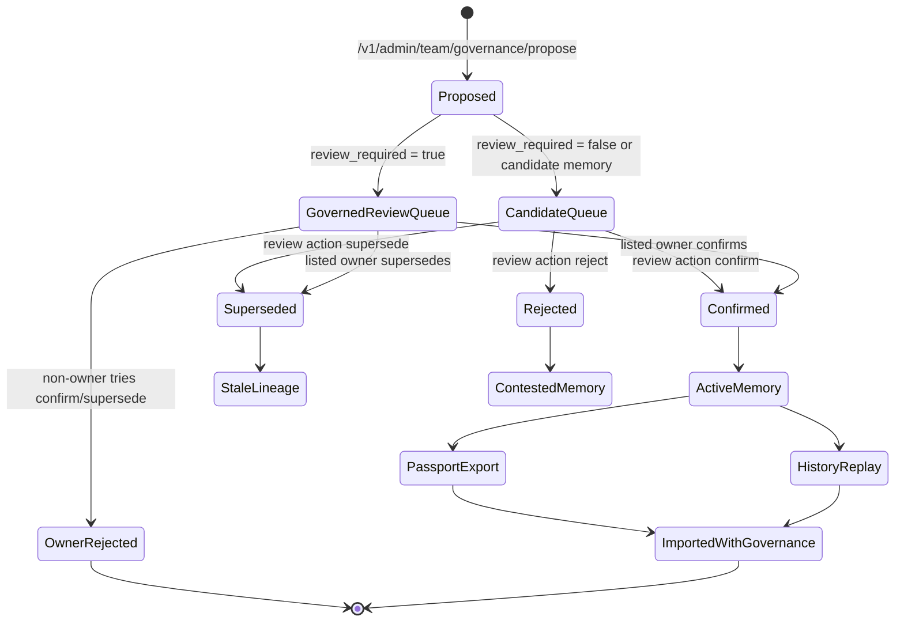
```mermaid
stateDiagram-v2
    [*] --> Proposed: /v1/admin/team/governance/propose

    Proposed --> CandidateQueue: review_required = false or candidate memory
    Proposed --> GovernedReviewQueue: review_required = true

    CandidateQueue --> Confirmed: review action confirm
    CandidateQueue --> Rejected: review action reject
    CandidateQueue --> Superseded: review action supersede

    GovernedReviewQueue --> OwnerRejected: non-owner tries confirm/supersede
    GovernedReviewQueue --> Confirmed: listed owner confirms
    GovernedReviewQueue --> Superseded: listed owner supersedes

    Confirmed --> ActiveMemory
    Superseded --> StaleLineage
    Rejected --> ContestedMemory

    ActiveMemory --> PassportExport
    ActiveMemory --> HistoryReplay
    PassportExport --> ImportedWithGovernance
    HistoryReplay --> ImportedWithGovernance

    OwnerRejected --> [*]
    ImportedWithGovernance --> [*]
```

## 19. Portable Artifact Trust and Reader Paths

The portability stack is now a connected machine rather than separate isolated features:
- bundle/passport/history export can be signed
- verify/reader/validate share the same trust fabric
- revoke/restore changes reader trust state without mutating the raw artifact
- import and replay stay dry-runnable before any write

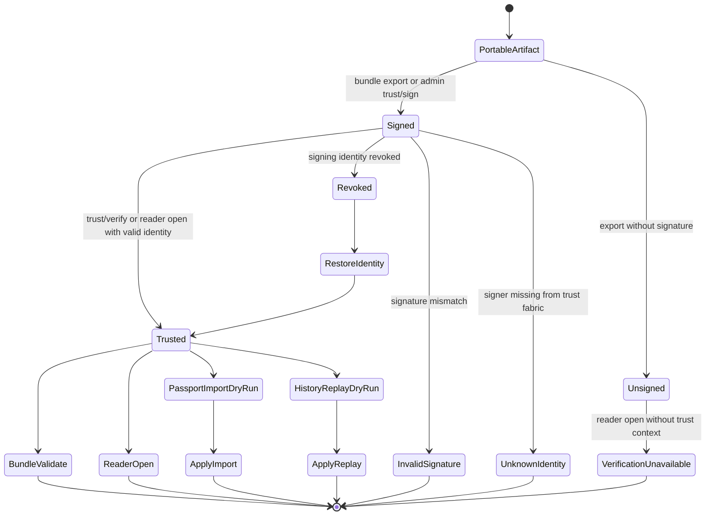
```mermaid
stateDiagram-v2
    [*] --> PortableArtifact

    PortableArtifact --> Unsigned: export without signature
    PortableArtifact --> Signed: bundle export or admin trust/sign

    Signed --> Trusted: trust/verify or reader open with valid identity
    Signed --> Revoked: signing identity revoked
    Signed --> InvalidSignature: signature mismatch
    Signed --> UnknownIdentity: signer missing from trust fabric
    Unsigned --> VerificationUnavailable: reader open without trust context

    Trusted --> ReaderOpen
    Trusted --> BundleValidate
    Trusted --> PassportImportDryRun
    Trusted --> HistoryReplayDryRun

    Revoked --> RestoreIdentity
    RestoreIdentity --> Trusted

    BundleValidate --> [*]
    ReaderOpen --> [*]
    PassportImportDryRun --> ApplyImport
    HistoryReplayDryRun --> ApplyReplay
    ApplyImport --> [*]
    ApplyReplay --> [*]
    InvalidSignature --> [*]
    UnknownIdentity --> [*]
    VerificationUnavailable --> [*]
```

## 20. Report Publication Pipeline

This was the main missing connection found during the state-machine audit:
- `run_all.sh` already executed `update_plane` and `compatibility_lts`
- but the generated report path did not surface either one as report sections or summary metrics
- that link is now wired through `tests/generate_report.py` into the generated report artifacts

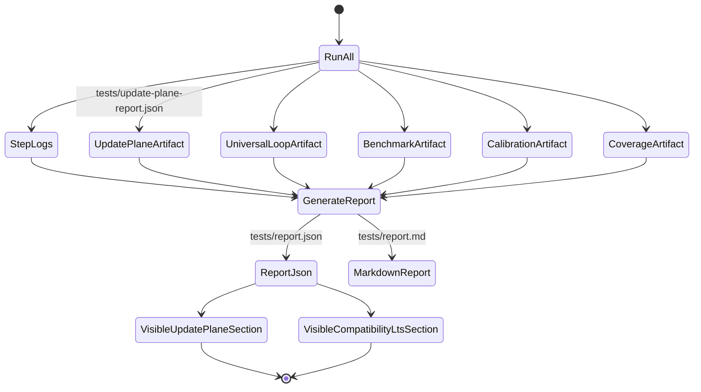
```mermaid
stateDiagram-v2
    [*] --> RunAll

    RunAll --> StepLogs
    RunAll --> UpdatePlaneArtifact: tests/update-plane-report.json
    RunAll --> UniversalLoopArtifact
    RunAll --> BenchmarkArtifact
    RunAll --> CalibrationArtifact
    RunAll --> CoverageArtifact

    StepLogs --> GenerateReport
    UpdatePlaneArtifact --> GenerateReport
    UniversalLoopArtifact --> GenerateReport
    BenchmarkArtifact --> GenerateReport
    CalibrationArtifact --> GenerateReport
    CoverageArtifact --> GenerateReport

    GenerateReport --> ReportJson: tests/report.json
    GenerateReport --> MarkdownReport: tests/report.md

    ReportJson --> VisibleUpdatePlaneSection
    ReportJson --> VisibleCompatibilityLtsSection

    VisibleUpdatePlaneSection --> [*]
    VisibleCompatibilityLtsSection --> [*]
```

## 21. Setup Profiles, Team Bootstrap, and Doctor Repair

This is the install and drift-repair machine for Claude, Codex, Cursor, and team-node workstations:
- setup detects installed clients and selects only the profile-relevant managed surfaces
- explicit non-Cursor profiles prune managed Cursor state instead of leaving stale files behind
- `team-node` persists a bootstrap receipt so `doctor --repair` can replay the same trust/catalog rollout later

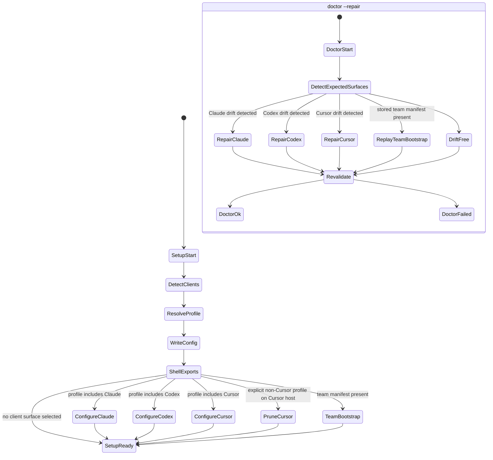
```mermaid
stateDiagram-v2
    [*] --> SetupStart

    SetupStart --> DetectClients
    DetectClients --> ResolveProfile
    ResolveProfile --> WriteConfig
    WriteConfig --> ShellExports

    ShellExports --> ConfigureClaude: profile includes Claude
    ShellExports --> ConfigureCodex: profile includes Codex
    ShellExports --> ConfigureCursor: profile includes Cursor
    ShellExports --> PruneCursor: explicit non-Cursor profile on Cursor host
    ShellExports --> TeamBootstrap: team manifest present
    ShellExports --> SetupReady: no client surface selected

    ConfigureClaude --> SetupReady
    ConfigureCodex --> SetupReady
    ConfigureCursor --> SetupReady
    PruneCursor --> SetupReady
    TeamBootstrap --> SetupReady

    state "doctor --repair" as DoctorRepair {
        [*] --> DoctorStart
        DoctorStart --> DetectExpectedSurfaces
        DetectExpectedSurfaces --> DriftFree
        DetectExpectedSurfaces --> RepairClaude: Claude drift detected
        DetectExpectedSurfaces --> RepairCodex: Codex drift detected
        DetectExpectedSurfaces --> RepairCursor: Cursor drift detected
        DetectExpectedSurfaces --> ReplayTeamBootstrap: stored team manifest present
        RepairClaude --> Revalidate
        RepairCodex --> Revalidate
        RepairCursor --> Revalidate
        ReplayTeamBootstrap --> Revalidate
        DriftFree --> Revalidate
        Revalidate --> DoctorOk
        Revalidate --> DoctorFailed
    }
```

Audit note:
- no dead path was found between setup, persisted team bootstrap, and `doctor --repair`
- setup and repair share the same managed-surface boundaries instead of drifting by client type

## 22. Ambient Connector Ingest and Review Promotion

Ambient connectors now feed the same governed review system as manual or imported memories:
- manifest discovery tells callers where ingest and review live
- dry-run preview stops before any write
- real ingest goes through dedup, contradiction detection, store, index catch-up, and review queue refresh

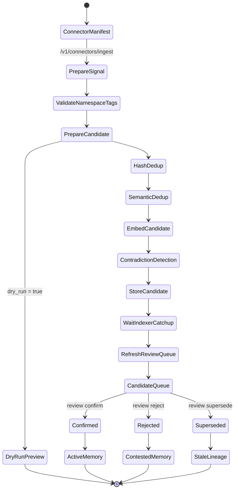
```mermaid
stateDiagram-v2
    [*] --> ConnectorManifest

    ConnectorManifest --> PrepareSignal: /v1/connectors/ingest
    PrepareSignal --> ValidateNamespaceTags
    ValidateNamespaceTags --> PrepareCandidate
    PrepareCandidate --> DryRunPreview: dry_run = true
    PrepareCandidate --> HashDedup

    HashDedup --> SemanticDedup
    SemanticDedup --> EmbedCandidate
    EmbedCandidate --> ContradictionDetection
    ContradictionDetection --> StoreCandidate
    StoreCandidate --> WaitIndexerCatchup
    WaitIndexerCatchup --> RefreshReviewQueue
    RefreshReviewQueue --> CandidateQueue

    CandidateQueue --> Confirmed: review confirm
    CandidateQueue --> Rejected: review reject
    CandidateQueue --> Superseded: review supersede

    DryRunPreview --> [*]
    Confirmed --> ActiveMemory
    Rejected --> ContestedMemory
    Superseded --> StaleLineage
    ActiveMemory --> [*]
    ContestedMemory --> [*]
    StaleLineage --> [*]
```

Audit note:
- no missing connection was found between connector ingest and the normal review/governance path
- connector writes invalidate intent cache and refresh review summaries on the same path as other staged imports

## 23. Portable Trust Catalog Mutation Path

Section 19 describes artifact trust outcomes. This machine covers the registry mutations that feed those outcomes:
- catalog import merges shared identities/revocations into the local registry
- local pin/unpin marks an identity as an explicit trust root without deleting it
- revoke/restore flips trust state without mutating existing artifact bytes

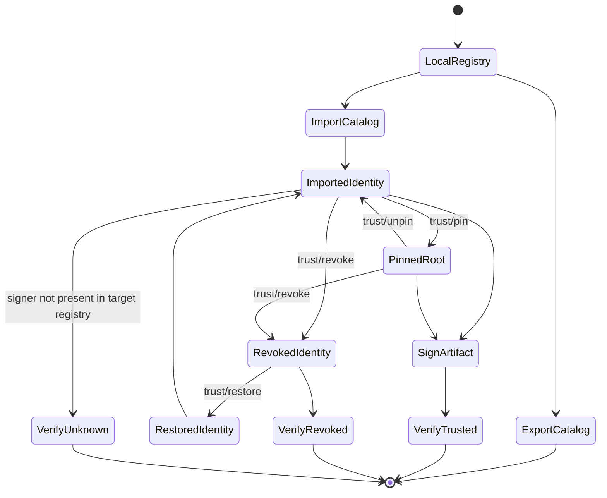
```mermaid
stateDiagram-v2
    [*] --> LocalRegistry

    LocalRegistry --> ExportCatalog
    LocalRegistry --> ImportCatalog
    ImportCatalog --> ImportedIdentity
    ImportedIdentity --> PinnedRoot: trust/pin
    PinnedRoot --> ImportedIdentity: trust/unpin

    ImportedIdentity --> RevokedIdentity: trust/revoke
    PinnedRoot --> RevokedIdentity: trust/revoke
    RevokedIdentity --> RestoredIdentity: trust/restore
    RestoredIdentity --> ImportedIdentity

    ImportedIdentity --> SignArtifact
    PinnedRoot --> SignArtifact
    SignArtifact --> VerifyTrusted
    RevokedIdentity --> VerifyRevoked
    ImportedIdentity --> VerifyUnknown: signer not present in target registry

    ExportCatalog --> [*]
    VerifyTrusted --> [*]
    VerifyRevoked --> [*]
    VerifyUnknown --> [*]
```

Audit note:
- pin/unpin, revoke/restore, verify, and reader-open all consume the same registry state
- no dead branch was found where catalog mutations stopped influencing verify/reader decisions

## 24. Embedding Model Drift and Migration Path

This was the real missing system-level connection found in the current audit:
- `serve` rebuilds the vector index from stored embeddings using the configured runtime dimension
- after a model change, stale stored embeddings can therefore fail the next `serve`
- `doctor` now checks that stored embedding dimensions match the configured model before runtime startup

```mermaid
stateDiagram-v2
    [*] --> ConfiguredModel

    ConfiguredModel --> InspectStoredEmbeddings
    InspectStoredEmbeddings --> DimensionsMatch
    InspectStoredEmbeddings --> DimensionDrift

    DimensionsMatch --> DoctorOk
    DimensionsMatch --> ServeStartup
    ServeStartup --> RebuildVectorIndex
    RebuildVectorIndex --> RuntimeReady

    DimensionDrift --> DoctorFail
    DimensionDrift --> ServeFailBeforeReady
    DoctorFail --> RunMigrateEmbeddings
    RunMigrateEmbeddings --> RestartServer
    RestartServer --> ServeStartup

    RuntimeReady --> [*]
    ServeFailBeforeReady --> [*]
```

Audit note:
- this was not just documentation drift; it was a real missing diagnosis edge
- `doctor` now surfaces the drift with an explicit `migrate-embeddings` hint instead of letting `serve` be the first hard failure

## 25. Benchmark Stable Lane and Open Comparison Lane

The benchmark runner now has an explicit stabilization edge between index catch-up and open-lane threshold evaluation:
- stable lane proves the local regression and injection path
- open comparison lane runs the published external fixtures
- transient early misses after indexing no longer fail immediately; the runner retries through the stabilization path first

```mermaid
stateDiagram-v2
    [*] --> SeedCorpus
    SeedCorpus --> WaitForIndexerSync
    WaitForIndexerSync --> StableLane
    StableLane --> OpenComparisonLane

    OpenComparisonLane --> ThresholdPass
    OpenComparisonLane --> StabilizeAfterCatchup: failed thresholds after first probe
    StabilizeAfterCatchup --> ThresholdPass
    StabilizeAfterCatchup --> ThresholdFail

    ThresholdPass --> PublishBenchmarkReport
    ThresholdFail --> RunnerFail
    PublishBenchmarkReport --> [*]
    RunnerFail --> [*]
```

Audit note:
- no dead path remains in the comparison lane; the failure edge is now reserved for genuine threshold misses after stabilization

## 26. Derived Index Materialization

This path was confirmed directly from the dry-run workspace trace:
- `redb` is the source of truth
- vector and FTS indexes are derived runtime state
- absence of a persisted vector index is therefore not itself a broken path when the stored memories can rebuild it on the next `serve`

```mermaid
stateDiagram-v2
    [*] --> StoredMemoriesInRedb

    StoredMemoriesInRedb --> ServeStartup
    ServeStartup --> OpenDerivedIndexes
    OpenDerivedIndexes --> PersistedIndexesPresent
    OpenDerivedIndexes --> PersistedIndexesMissing

    PersistedIndexesPresent --> RebuildFromRedb
    PersistedIndexesMissing --> RebuildFromRedb
    RebuildFromRedb --> RuntimeReady

    state "doctor" as DoctorDerived {
        [*] --> InspectDiskArtifacts
        InspectDiskArtifacts --> MaterializedOnDisk
        InspectDiskArtifacts --> StartupDerivedOnly
        MaterializedOnDisk --> DoctorOk
        StartupDerivedOnly --> DoctorOk
    }
```

Audit note:
- the dry-run trace showed `vector_keys.json` without `vectors.usearch`
- `doctor` now treats that as startup-derived state instead of a false hard failure

## 27. Current Audit Findings

State-machine audit result on the current codebase:

- No confirmed dead runtime path was found in the governed memory, portability, trust, setup/repair, connector, or release/update planes.
- One real missing connection existed in the operator diagnosis plane: changing the configured embedding model could make the next `serve` fail before `doctor` warned about stale stored embedding dimensions.
- A second diagnosis mismatch appeared in the dry-run trace: `doctor` treated missing on-disk vector artifacts as a failure even though startup rebuilds derived vector state from `redb`.
- That diagnosis edge is now fixed in `src/main.rs`; `doctor` surfaces stored embedding/model drift and points to `memoryoss migrate-embeddings`.
- The derived-index diagnosis is now also fixed in `src/main.rs`; startup-derived vector state is reported as healthy instead of dead.
- Setup/doctor repair, ambient connector ingest, trust-catalog mutation, and benchmark stabilization were already connected in code, but were previously under-modeled in this document.

## 28. Public Streamable HTTP MCP and Smithery External Deploy Path

This is the currently shipped public directory path:
- local memory core on `127.0.0.1:8000`
- Node streamable HTTP bridge on `127.0.0.1:8012`
- nginx exposes `https://memoryoss.com/mcp`
- Smithery publishes that endpoint as `external_shttp`

```mermaid
stateDiagram-v2
    [*] --> BuildBridgeBundle
    BuildBridgeBundle --> SystemdStart
    SystemdStart --> BridgeListening
    BridgeListening --> LocalHealthOk: GET /health
    BridgeListening --> LocalHealthFail: upstream unreachable

    LocalHealthOk --> NginxProxy
    NginxProxy --> PublicMcpHealth: GET /mcp/health
    NginxProxy --> PublicInitialize: POST /mcp initialize
    NginxProxy --> PublicToolsList: POST /mcp tools/list
    NginxProxy --> PublicToolCall: POST /mcp tools/call

    PublicToolCall --> MissingApiKey: no memoryoss-api-key / Bearer header
    PublicToolCall --> InvalidApiKey: upstream 401
    PublicToolCall --> UpstreamCrud: valid API key

    UpstreamCrud --> RecallPath
    UpstreamCrud --> StorePath
    UpstreamCrud --> UpdatePath
    UpstreamCrud --> ForgetPath

    PublicInitialize --> SmitheryPublish
    PublicToolsList --> SmitheryPublish
    SmitheryPublish --> ExternalShttpRelease: release accepted
    ExternalShttpRelease --> [*]

    MissingApiKey --> [*]
    InvalidApiKey --> [*]
    LocalHealthFail --> [*]
    RecallPath --> [*]
    StorePath --> [*]
    UpdatePath --> [*]
    ForgetPath --> [*]
```

Audit note:
- this path is now live and verified through `https://memoryoss.com/mcp`
- the earlier suspected `memoryoss_update` dead path did not survive a controlled re-test and is not treated as a confirmed dead branch

## 29. Install Surface Machine

The documented install surface is four-way, but the branches converge into the same setup/runtime machine afterwards.

```mermaid
stateDiagram-v2
    [*] --> ChooseInstallSurface

    ChooseInstallSurface --> ReleaseBinary: GitHub release archive
    ChooseInstallSurface --> InstallHelper: curl install.sh
    ChooseInstallSurface --> CargoSource: cargo install --git
    ChooseInstallSurface --> ContainerPath: GHCR image

    ReleaseBinary --> BinaryPresent
    InstallHelper --> BinaryPresent
    CargoSource --> BinaryPresent
    ContainerPath --> ContainerConfigReady

    BinaryPresent --> SetupWizard: memoryoss setup --profile <profile>
    SetupWizard --> ManagedClientSurfaces
    ManagedClientSurfaces --> ServeOrMcp

    ContainerConfigReady --> ServeOnly
    ServeOnly --> ProxyUsage

    ServeOrMcp --> ProxyUsage
    ServeOrMcp --> ExplicitMcpUsage

    ProxyUsage --> DoctorRepair
    ExplicitMcpUsage --> DoctorRepair
    DoctorRepair --> [*]
```

Important convergence:
- binary, helper, and source installs all converge into the same `setup -> managed client surfaces -> serve/mcp-server` runtime path
- the container path is intentionally different: it skips the local desktop setup wizard and expects explicit config plus self-hosted usage

## 30. Per-Request Memory Mode State Machine

This is the real four-way runtime branch behind `X-Memory-Mode`.

```mermaid
stateDiagram-v2
    [*] --> ProxyRequest
    ProxyRequest --> ParseMemoryHeaders

    ParseMemoryHeaders --> FullMode: full or invalid fallback
    ParseMemoryHeaders --> ReadOnlyMode: readonly
    ParseMemoryHeaders --> AfterMode: after + valid date
    ParseMemoryHeaders --> OffMode: off / bypass

    FullMode --> RecallAndInject
    RecallAndInject --> UpstreamCall
    UpstreamCall --> ExtractAndStore
    ExtractAndStore --> [*]

    ReadOnlyMode --> RecallAndInjectReadonly
    RecallAndInjectReadonly --> UpstreamReadOnly
    UpstreamReadOnly --> NoStore
    NoStore --> [*]

    AfterMode --> FilterRecallByDate
    FilterRecallByDate --> InjectFilteredHits
    FilterRecallByDate --> NoEligibleRecall
    InjectFilteredHits --> UpstreamAfter
    NoEligibleRecall --> UpstreamAfter
    UpstreamAfter --> ExtractAndStoreAfter
    ExtractAndStoreAfter --> [*]

    OffMode --> DirectUpstream
    DirectUpstream --> NoRecallNoStore
    NoRecallNoStore --> [*]
```

Dry-run result on 2026-03-20 via [tests/run_state_machine_dryrun.py](/root/engraim/tests/run_state_machine_dryrun.py) and [state-machine-dryrun-report.json](/root/engraim/tests/state-machine-dryrun-report.json):
- `full`: the proxy injected a `<memory_context>` system block, called the extraction upstream once, and persisted the extracted fact
- `readonly`: the proxy injected a `<memory_context>` system block, but never called extraction and did not persist a new fact
- `after` with a future cutoff: the proxy skipped recall injection, still called extraction once, and persisted the mode-specific fact
- `off`: the proxy skipped recall injection, never called extraction, and did not persist a new fact

This converts the four runtime branches from “documented behavior” into a repeatable system-level verification path.

## 31. March 19 Addendum

Controlled follow-up after the live sysaudit:

- The previously suspected `memoryoss_update` dead path was re-tested directly against `/v1/update` and through the public MCP bridge and was **not reproducible** under a clean `store -> update -> recall -> forget` sequence.
- The real confirmed production findings from that audit were different:
  - nginx backup config in `sites-enabled` caused duplicate `server_name` warnings and was removed from the live include set
  - the public HTTP bridge leaked `X-Powered-By: Express` and now disables that header
  - the public MCP bridge and Smithery `external_shttp` deployment path are now modeled explicitly above instead of being left out of the state-machine coverage
- A real missing connection was found and fixed in the proxy extraction plane: OpenAI extraction previously ignored custom OpenAI-compatible `proxy.upstream_url` values and silently fell back to the default OpenAI cloud endpoint. `resolve_extraction_endpoint()` now routes custom OpenAI bases to `{upstream_url}/chat/completions`, which unblocks deterministic local dry-runs and self-hosted OpenAI-compatible extraction backends.
- The dry-run harness was tightened to verify what the system actually does today:
  - prefer an explicit/current binary over an older installed binary
  - detect recall injection by `<memory_context>` rather than raw seed text, because injection compacts memories into summaries/evidence
  - verify stored extracted facts through `/v1/memories`, which sees quarantined `Candidate` memories immediately even when recall/index paths are still catching up
  - treat fused extracted facts as valid when the expected mode-specific fact is present within the stored content
